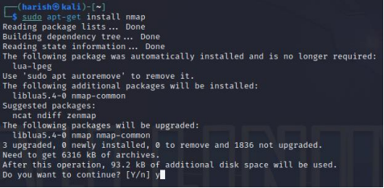
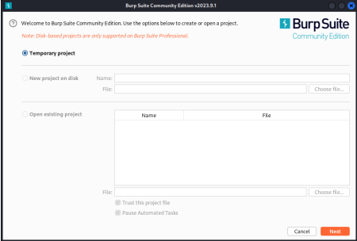
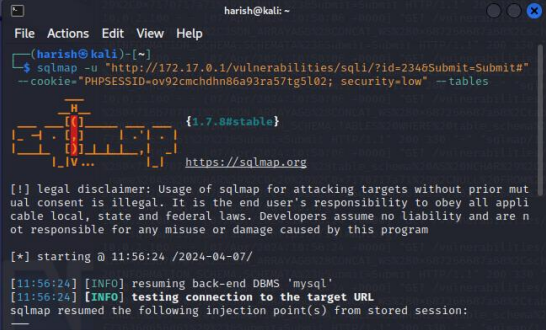
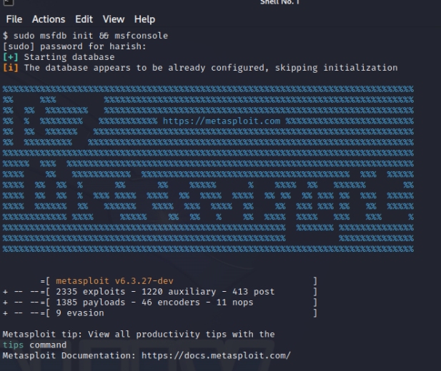

# 02 — Lab Environment

## Overview

The testing environment was built using **VirtualBox** with Kali Linux and Metasploitable 2.

The machines were connected using a custom **NAT Network**, allowing them to communicate while keeping the testing environment isolated from other networks.

## Architecture

```text
                 Host PC
        AMD Ryzen 7 5800X / 32 GB RAM
                       |
                   VirtualBox
                       |
              Custom NAT Network
                 /           \
                /             \
        Kali Linux        Metasploitable 2
        Pen-testing         Vulnerable VM
           tools               Target
```

## Host Hardware

| Component | Specification |
|---|---|
| CPU | AMD Ryzen 7 5800X |
| RAM | 32 GB |
| Storage | 500 GB SSD |
| Virtualisation | VirtualBox |

## Virtual Machines

### Kali Linux

Used as the penetration-testing workstation. The selected tools were available within Kali Linux.

### Metasploitable 2

Used as the intentionally vulnerable target machine.

## Network

Both machines were configured on the custom NAT Network so that they could communicate for testing while remaining within the controlled lab.

## Evidence





