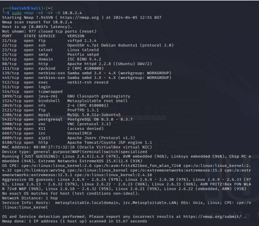
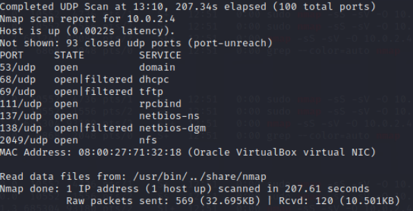
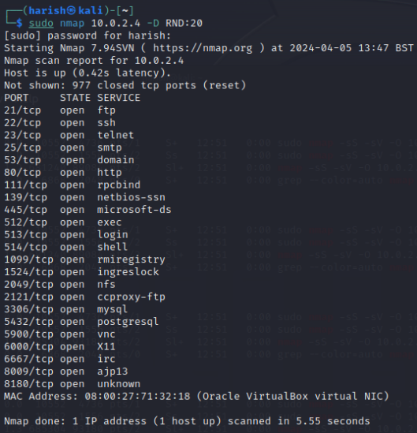
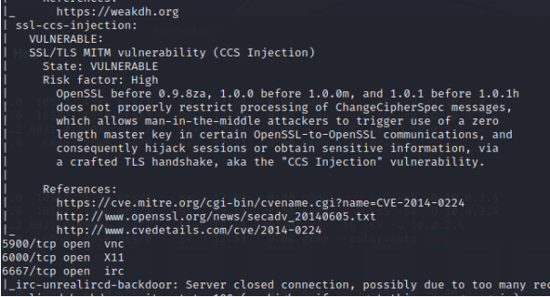

# 03 — Nmap

## Purpose

Nmap was evaluated as the network reconnaissance and scanning component of the project.

## Tests Performed

### TCP SYN + Service + OS Detection

```bash
sudo nmap -sS -sV -O 10.0.2.4
```


The test was used to identify open ports, running services, service versions and the operating system.

### UDP Scan

```bash
sudo nmap -sU -F -v 10.0.2.4
```


This scan was used to identify services operating on UDP ports.

### Decoy Scan

```bash
sudo nmap 10.0.2.4 -D RND:20
```


A decoy scan was used to send traffic from multiple apparent source addresses.

### Vulnerability Scan

```bash
nmap 10.0.2.4 --script vuln
```


Nmap vulnerability-detection scripts were used to identify potential vulnerabilities on the target.

## Results

The scans identified multiple open services and vulnerabilities on Metasploitable 2. The findings were then used as the basis for further testing with other tools.

## What This Demonstrated

- Network reconnaissance
- Port scanning
- Service/version detection
- OS detection
- Vulnerability identification

## Screenshots

Place the corresponding evidence in:

`../screenshots/nmap/`
