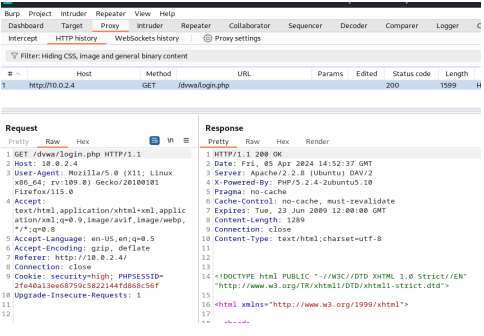
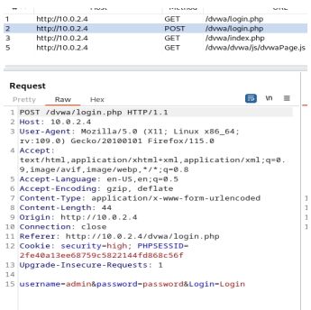
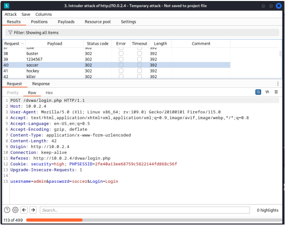
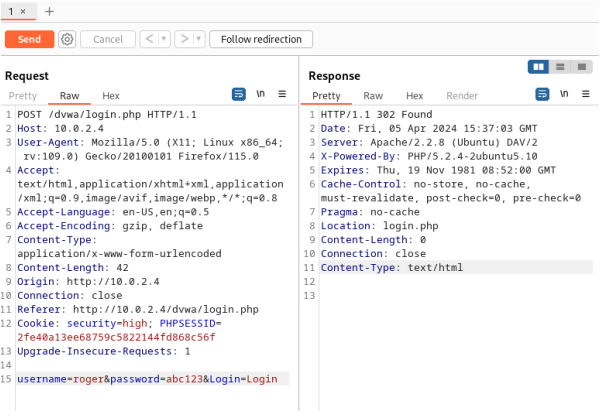
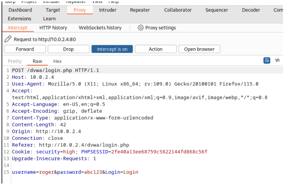

# 04 — Burp Suite

## Purpose

Burp Suite was used to assess the security of web applications running on Metasploitable 2.

## Activities

### Proxy

Burp Suite was configured to capture HTTP traffic between the client and the target.

The HTTP history provided information about requests, responses, status codes and server information.

### Login Request Analysis

A login request was captured through the proxy. The request demonstrated how submitted credentials could be observed within an intercepted request in the deliberately vulnerable lab.

### Intruder

The Intruder tool was used to demonstrate a controlled password-testing activity against the vulnerable login functionality.

### Repeater

Repeater was used to modify and resend HTTP requests to examine how the web application responded to different input.

### Intercept

The Proxy Intercept function was used to pause requests before they reached the server, allowing the request data to be inspected and modified.

## Findings

The implementation demonstrated the usefulness of Burp Suite for:

- HTTP request/response analysis
- Web application testing
- Request manipulation
- Controlled authentication testing

The project used the Community Edition, which has limitations compared with Burp Suite Professional.
