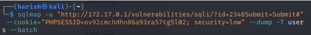
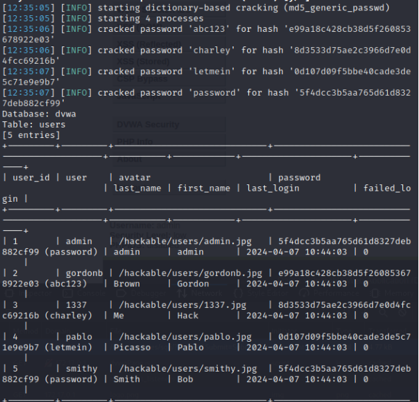

# 05 — SQLmap

## Purpose

SQLmap was evaluated for detecting and exploiting SQL injection vulnerabilities in the web application environment.

## Installation

SQLmap was available within Kali Linux. The report also documented installation/update commands.

```bash
sudo apt install sqlmap
sudo apt-get upgrade sqlmap
```

## Database Enumeration

The project used SQLmap to test the target web application for SQL injection and enumerate database tables.

Example structure from the project:

```bash
sqlmap -u <TARGET_URL> --cookie=<COOKIE> --tables
```


## Findings



The testing identified several SQL injection techniques, including:

- Boolean-based blind
- Error-based
- Time-based blind
- UNION query injection

The implementation also demonstrated extraction of database information and password hashes from the vulnerable test environment.

## Results

SQLmap successfully extracted information from the vulnerable database, including user-related records and password hashes. Dictionary-based cracking was also demonstrated against the extracted hashes.
