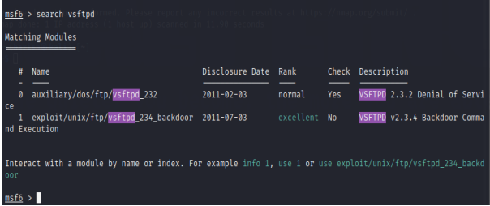
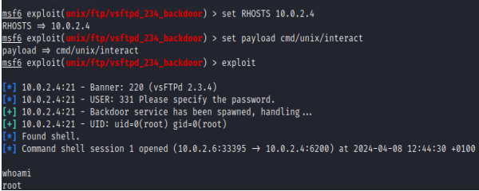

# 06 — Metasploit

## Purpose

Metasploit was used to demonstrate exploitation of a vulnerable service identified during reconnaissance.

## Workflow

```text
Nmap
  |
  v
Identify vulnerable service
  |
  v
Search Metasploit modules
  |
  v
Configure target
  |
  v
Select payload
  |
  v
Execute exploit
  |
  v
Verify access
```

## Target

The project used the vulnerable **vsftpd** service running on Metasploitable 2.

## Module Discovery



The Metasploit search functionality was used to locate an appropriate module for the identified service.

## Exploitation

The project configured the target using `RHOSTS`, selected a payload and executed the exploit against the deliberately vulnerable service.



The resulting session allowed command execution on the target. The `whoami` command was used to verify the resulting privileges.

## Findings

The implementation demonstrated how reconnaissance results can lead to exploitation within a controlled penetration-testing workflow.
